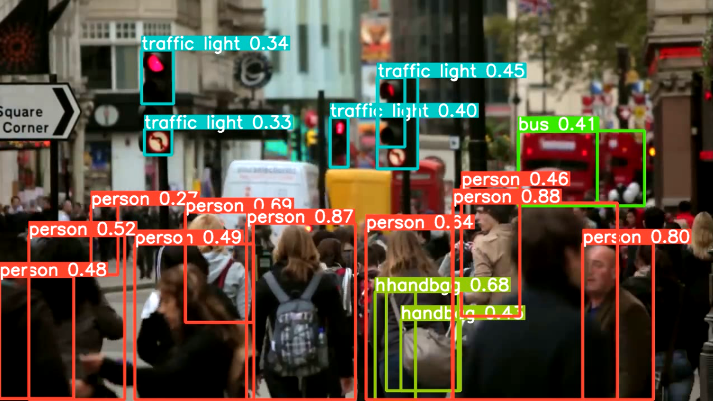

# Real-Time Crowd Tracker

This project is designed for real-time crowd tracking using multiple video streams, leveraging the YOLO (You Only Look Once) deep learning model for object detection. It effectively manages concurrent video streams to monitor and analyze crowds in different environments.

## Features
- Real-time tracking of crowds from multiple video sources, including downloaded YouTube videos and live webcam feeds.
- Utilization of YOLOv8 model for accurate crowd detection and tracking.
- Concurrent handling of video streams using multi-threading.

## Prerequisites
Before using this project, ensure you have the following installed:
- Python 3.6 or later.
- OpenCV (`opencv-python`) for video processing.
- `pytube` for downloading videos from YouTube.
- `ultralytics` YOLO library for object detection.

## Installation

1. Clone the repository:
   ```
   git clone https://github.com/qolaba/people-tracking-camera-poc.git
   ```
2. Navigate to the cloned directory:
   ```
   cd people-tracking-camera-poc
   ```
3. Install the necessary Python libraries:
   ```
   pip install -r requirements.txt
   ```

## Usage

Run the `main.py` script to start the crowd tracker:
```
python main.py
```

This script will initiate crowd tracking on user-specified video sources, including a YouTube video and webcam streams.

### Configuring Video Sources for Tracking

To track crowds from specific video sources, modify the `video_url` variable in the `main()` function with the desired YouTube video URL and adjust webcam or external camera source identifiers as needed.

## Example Images

Below are some example images showcasing the crowd tracking results using the YOLOv8 model:

Crowd Tracking Example 1


*Example of crowd tracking during an event.*

Crowd Tracking Example 2



*Example of crowd tracking in an urban setting.*

These images illustrate the effectiveness of the YOLOv8 model in accurately detecting and tracking individuals in a crowd.

## About YOLO (You Only Look Once)

YOLO is a cutting-edge real-time object detection system renowned for its speed and precision. It approaches object detection as a regression problem, identifying bounding boxes and class probabilities. YOLOv8, utilized in this project, is the latest version in the YOLO series, offering enhanced speed and detection accuracy.

## Contribution

We welcome contributions to enhance and expand the project's capabilities. Feel free to fork the repository, implement your changes, and submit a pull request.
